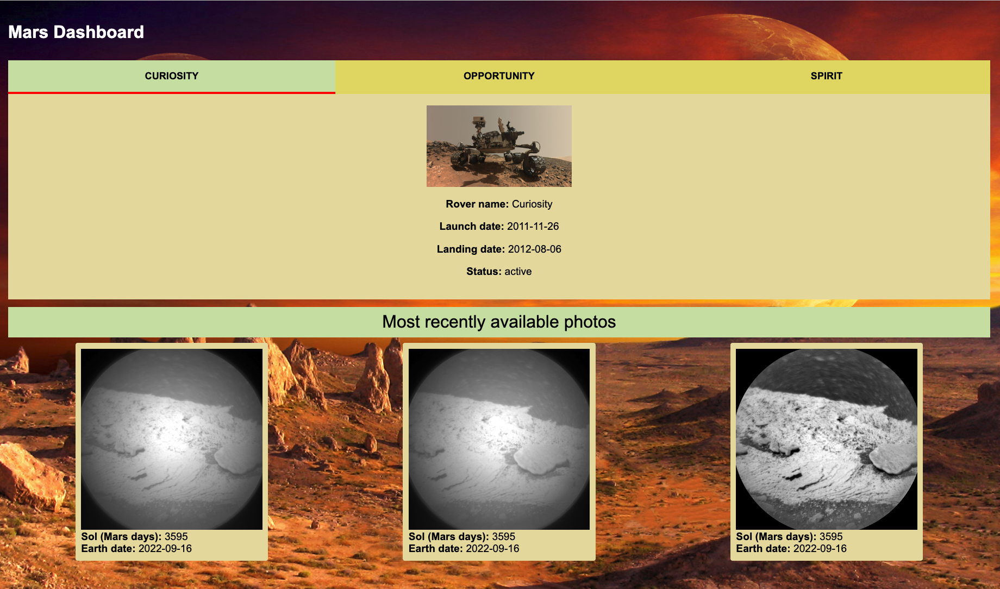

# Mars Dashboard

### Big Picture

You are going to create a Mars rover dashboard that consumes the NASA API. Your dashboard will allow the user to select which rover's information they want to view. Once they have selected a rover, they will be able to see the most recent images taken by that rover, as well as important information about the rover and its mission. Your app will make use of all the functional concepts and practices you have learned in this course, and the goal is that you would become very comfortable using pure functions and iterating over, reshaping, and accessing information from complex API responses. 

### Getting Started

    npm install
    npm start
### Using the App
After start server with command `npm start` above then open url below on browser

    http://localhost:3000/
### Project Requirements

To complete this project, your UI must show the following:

- [x] A gallery of the most recent images sent from each mars rover
- [x] The launch date, landing date, name and status along with any other information about the rover
- [x] A selection bar for the user to choose which rover's information they want to see

To complete this project, your UI must do the following:

- [x] Be responsive. Needs to look good(aka not broken) on phones(max width 768px) and desktop(min-width 991px, max-width 1824px). Tablet view is optional.
- [x] Provide a way to dynamically switch the UI to view one of the three rovers 
**This can be done using tabs, buttons, or any other UI control

To complete this project, your frontend code must:

- [x] Use only pure functions
- [x] Use at least one Higher Order Function
- [x] Use the array method `map`
- [x] Use the ImmutableJS library

To complete this project, your backend code must:

- [x] Be built with Node/Express
- [x] Make successful calls to the NASA API
- [x] Use pure functions to do any logic necessary
- [x] Hide any sensetive information from public view (In other words, use your dotenv file)

### Demo

