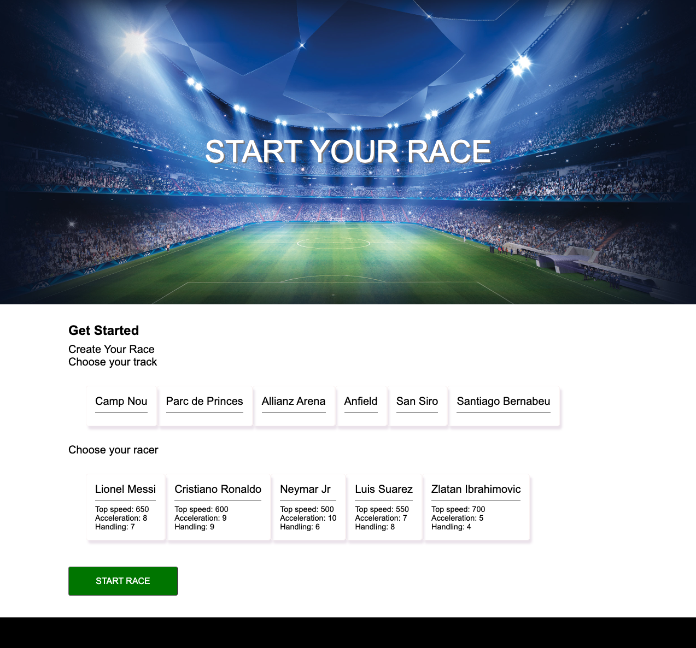
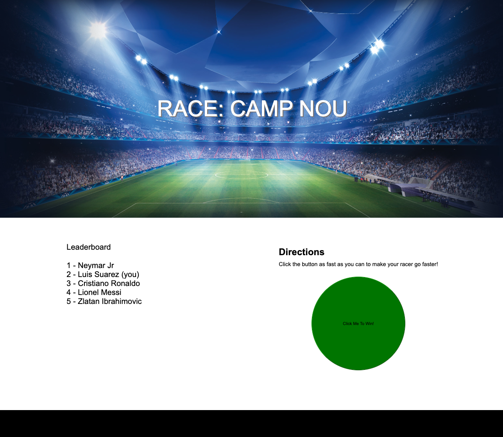

# UdaciRacer Simulation Game

## Project Introduction

Here is a partially built-out game that races cars—your job is to complete it! Throughout the game logic, you will find _"TODO"_ comments that must be completed in order for the game to work. You are going to use the asynchronous skills you gained in the course to fill in the blanks in this game.

The game mechanics are this: you select a player and track, the game begins and you accelerate your racer by clicking an acceleration button. As you accelerate so do the other players and the leaderboard live-updates as players change position on the track. The final view is a results page displaying the players' rankings.

The game has three main views:

1. The form to create a race

2. The race progress view (this includes the live-updating leaderboard and acceleration button)

3. The race results view

### Getting Started
In order to build this game, we need to run two things: the game engine API and the front end.

#### Start the Server
To run the server, locate your operating system and run the associated command in your terminal at the root of the project.

| Your OS               | Command to start the API                                  |
| --------------------- | --------------------------------------------------------- |
| Mac                   | `ORIGIN_ALLOWED=http://localhost:3000 ./bin/server-osx`   |
| Windows               | `ORIGIN_ALLOWED=http://localhost:3000 ./bin/server.exe`   |
| Linux (Ubuntu, etc..) | `ORIGIN_ALLOWED=http://localhost:3000 ./bin/server-linux` |

#### WINDOWS USERS -- Setting Environment Variables
If you are using a windows machine:
1. `cd` into the root of the project containing data.json 
2. Run the following command to add the environment variable:
```set DATA_FILE=./data.json```

#### Start front end
Note that this process will use your terminal tab, so you will have to open a new tab terminal and navigate back to the project root to start the front end by run

    npm install
    npm start
    
### Using the App
Access url

    http://localhost:3000/

### Demo


